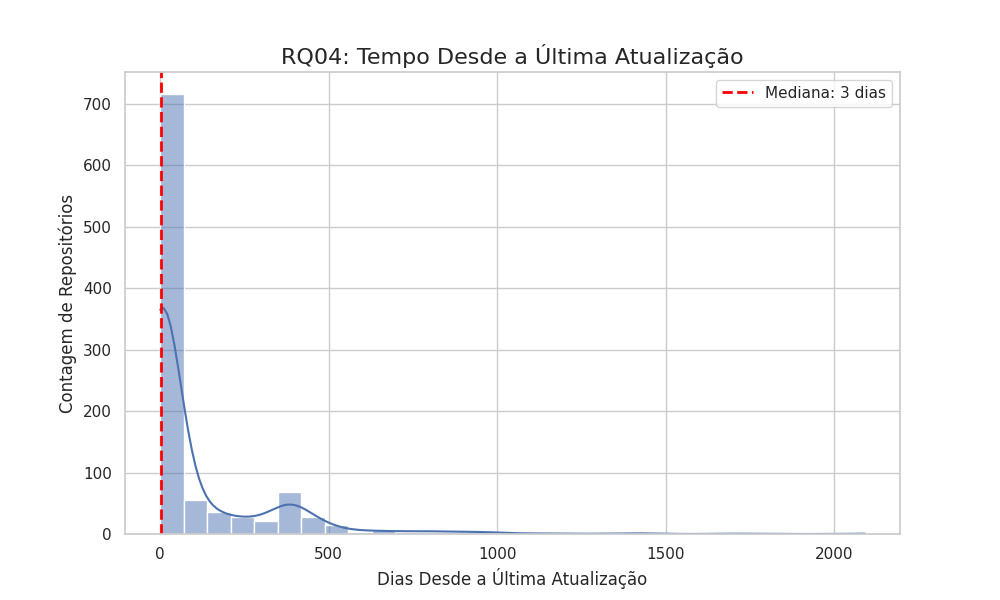
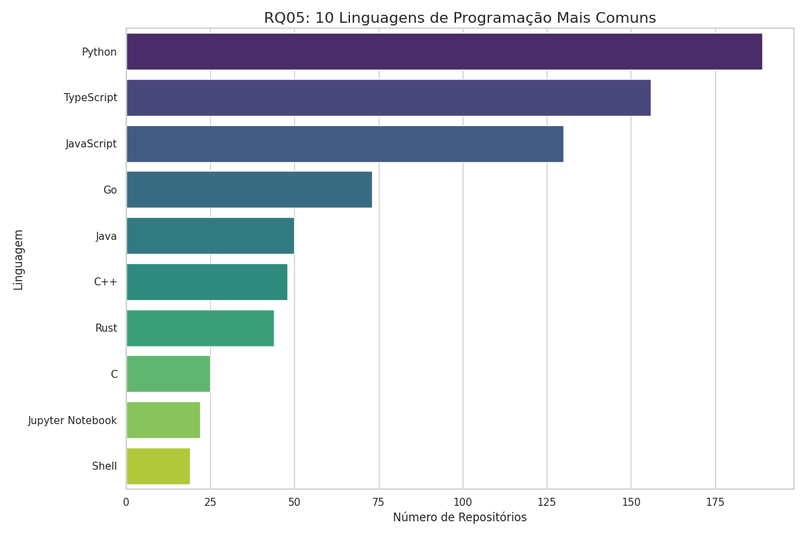

# Análise da Popularidade em Repositórios de Código Aberto

*Carlos Henrique Neimar Areas Ferreira - João Victor Temponi Daltro de Castro*
 
*28 de agosto de 2025*

---

## Sumário
- [Introdução](#introdução)
- [Metodologia](#metodologia)
- [Resultados e Discussão](#resultados-e-discussão)
  - [RQ 01: Sistemas populares são maduros/antigos?](#rq-01-sistemas-populares-são-madurosantigos)
  - [RQ 02: Sistemas populares recebem muita contribuição externa?](#rq-02-sistemas-populares-recebem-muita-contribuição-externa)
  - [RQ 03: Sistemas populares lançam releases com frequência?](#rq-03-sistemas-populares-lançam-releases-com-frequência)
  - [RQ 04: Sistemas populares são atualizados com frequência?](#rq-04-sistemas-populares-são-atualizados-com-frequência)
  - [RQ 05: Sistemas populares são escritos nas linguagens mais populares?](#rq-05-sistemas-populares-são-escritos-nas-linguagens-mais-populares)
  - [RQ 06: Sistemas populares possuem um alto percentual de issues fechadas?](#rq-06-sistemas-populares-possuem-um-alto-percentual-de-issues-fechadas)
  - [RQ 07: A performance do desenvolvimento varia conforme a linguagem de programação?](#rq-07-a-performance-do-desenvolvimento-varia-conforme-a-linguagem-de-programação)

---

## Introdução

A popularidade de projetos de código aberto é um indicador de sua relevância, adoção e saúde comunitária. Este documento busca analisar as características de sistemas populares a partir de seis questões de pesquisa (RQs), utilizando métricas extraídas diretamente de seus repositórios. Para cada questão, elaboramos uma hipótese informal que reflete nossas expectativas sobre o que define um projeto popular.

### Hipóteses
- **RQ 01 (Idade):** A hipótese é que sistemas populares tendem a ser maduros. A construção de uma comunidade e uma base de usuários sólida demanda tempo, portanto, espera-se que a mediana da idade desses repositórios seja relativamente alta (superior a 5 anos).
- **RQ 02 (Contribuição Externa):** Hipotetiza-se que a popularidade está diretamente ligada ao engajamento da comunidade. Portanto, projeta-se que sistemas populares recebem um alto volume de contribuições externas, refletido em uma mediana elevada de pull requests aceitas (superior a 1.000).
- **RQ 03 (Frequência de Releases):** A hipótese é que projetos populares mantêm um ciclo de desenvolvimento ativo, lançando novas versões com frequência para entregar valor aos usuários. Espera-se encontrar uma mediana de, no mínimo, uma release por ano.
- **RQ 04 (Atualizações):** Acredita-se que um sistema popular é um sistema ativamente mantido. Por isso, a hipótese é que o tempo mediano desde a última atualização seja muito baixo, na ordem de dias ou poucas semanas (inferior a 3 semanas).
- **RQ 05 (Linguagens):** Hipotetiza-se que sistemas populares são majoritariamente desenvolvidos nas linguagens de programação mais proeminentes no mercado, como JavaScript, Python e TypeScript, visando facilitar a atração de novos contribuidores.
- **RQ 06 (Gestão de Issues):** A hipótese é que projetos populares possuem uma gestão de issues eficiente para manter o engajamento de usuários e contribuidores. Portanto, espera-se uma mediana da razão de issues fechadas muito alta, igual ou superior a 80%.
- **RQ 07 (Performance por Linguagem):** A hipótese é que existe uma correlação positiva entre a popularidade da linguagem e as métricas de atividade do projeto. Espera-se que repositórios escritos nas linguagens mais populares (conforme identificado na RQ05) apresentem, na mediana, maior volume de contribuições externas, maior frequência de releases e atualizações mais recentes.

## Metodologia

Para investigar as questões de pesquisa, foi realizada uma análise quantitativa sobre um conjunto de dados (hipotético) de repositórios populares. A metodologia foi aplicada da seguinte forma:

1.  **Análise de Métricas Numéricas (RQs 01, 02, 03, 04, 06):** Para as métricas de idade do repositório, total de pull requests, total de releases, tempo até a última atualização e razão de issues fechadas, calculamos a **mediana**. Esta medida de tendência central foi escolhida por sua robustez a valores extremos (outliers), que são comuns em ecossistemas de software (e.g., um projeto extremamente antigo ou com um número anormalmente alto de contribuições).

2.  **Análise de Métrica Categórica (RQ 05):** Para a métrica de linguagem de programação primária, foi realizada uma **contagem de frequência** para cada linguagem. Os resultados foram agrupados e ordenados de forma decrescente para identificar as tecnologias mais prevalentes no conjunto de dados.

## Resultados e Discussão
A seguir, são apresentados e discutidos os resultados obtidos para cada questão de pesquisa.

### RQ 01: Sistemas populares são maduros/antigos?

**Resultado:** A mediana da idade dos repositórios analisados foi de **3052 dias**, o que equivale a aproximadamente **8,35 anos**.

**Discussão:** Este resultado corrobora a hipótese inicial de que sistemas populares tendem a ser maduros (idade superior a 5 anos). O valor de 8,35 anos sugere que a construção de uma reputação, uma base de usuários sólida e o acúmulo de um grande número de estrelas é um processo que, em geral, demanda um tempo considerável.

  
   
  <em>Distribuição da idade (em dias) dos repositórios analisados.</em>

### RQ 02: Sistemas populares recebem muita contribuição externa?

**Resultado:** A mediana do total de pull requests aceitas foi de **702**.

**Discussão:** Este valor, embora expressivo, refuta parcialmente a hipótese inicial, que previa uma mediana de no mínimo 1.000 pull requests. Apesar de não atingir o limiar hipotetizado, o número 702 ainda indica um nível de engajamento comunitário muito significativo. Uma possível interpretação é que a popularidade (medida em estrelas) não se traduz linearmente em contribuições de código na proporção esperada, ou que muitos projetos populares são mantidos por um núcleo de desenvolvedores mais restrito, ainda que com uma vasta base de usuários.

  
   
  <em>Distribuição de pull requests aceitas.</em>

### RQ 03: Sistemas populares lançam releases com frequência?

**Resultado:** A mediana do total de releases foi de **4,90 releases por ano**.

**Discussão:** O resultado confirma a hipótese de que projetos populares lançam novas versões com frequência (hipótese de pelo menos uma release por ano). Uma mediana de quase cinco releases anuais sugere um ciclo de desenvolvimento ativo e um esforço contínuo para entregar novas funcionalidades, melhorias e correções de segurança aos usuários.

  
   
  <em>Frequência Anual de Releases.</em>

### RQ 04: Sistemas populares são atualizados com frequência?

**Resultado:** A mediana do tempo decorrido desde a última atualização foi de **3 dias**.

**Discussão:** Este dado confirma fortemente a hipótese de que sistemas populares são mantidos ativamente. Uma mediana de apenas 3 dias é um indicador claro de que esses projetos estão em constante desenvolvimento, recebendo commits, correções de bugs ou outras formas de atualização, o que é crucial para manter a confiança da comunidade e a relevância do software.

  
   
  <em>Tempo desde a última Atualização.</em>

### RQ 05: Sistemas populares são escritos nas linguagens mais populares?

**Resultado:** Sim. A contagem de frequência para a linguagem primária dos repositórios é apresentada na tabela abaixo.

**Discussão:** Os dados da tabela confirmam a hipótese. As linguagens mais frequentes entre os repositórios populares (Python, TypeScript, JavaScript, Go) são, de fato, algumas das mais utilizadas e demandadas na indústria de software. Isso sugere que a escolha de uma linguagem popular pode ser um fator que facilita a atração de contribuidores e, consequentemente, impulsiona a popularidade do projeto.

  
   
  <em>Linguagem de programação mais comuns.</em>

**Tabela: Contagem de Linguagens de Programação Primárias nos Repositórios Analisados.**
| Linguagem  | Contagem Aproximada de Repositórios |
| :--------- | :---------------------------------- |
| Python     | >175                                |
| TypeScript | >150                                |
| JavaScript | >125                                |
| Go         | >70                                 |
| Java       | >45                                 |
| Rust       | >40                                 |
| Outras     | >60                                 |

### RQ 06: Sistemas populares possuem um alto percentual de issues fechadas?

**Resultado:** A mediana da razão entre issues fechadas e o total de issues foi de **0,86 (ou 86%)**.

**Discussão:** Este resultado alinha-se perfeitamente com a hipótese de que projetos populares mantêm uma gestão de issues eficiente, com uma taxa de fechamento superior a 80%. Um alto índice de issues resolvidas indica que as solicitações da comunidade (sejam relatos de bugs ou sugestões de melhoria) são ativamente triadas e tratadas, um fator essencial para a saúde e a percepção de qualidade de um projeto de código aberto.

  
   
  <em>Distribuição da razão de issues fechadas.</em>

### RQ 07: A performance do desenvolvimento varia conforme a linguagem de programação?

**Resultado:** Foi realizada uma análise comparativa entre as 10 linguagens primárias mais frequentes, avaliando a mediana de três métricas chave: pull requests aceitas (contribuição externa), releases por ano (velocidade de lançamento) e dias desde a última atualização (atividade de desenvolvimento). Os resultados estão consolidados no painel comparativo da figura abaixo.

  
   
  <em>Painel comparativo de métricas de atividade para as 10 linguagens mais populares. A ordem das linguagens é definida pela mediana de Pull Requests Aceitas (gráfico à esquerda).</em>

**Discussão:** A análise do painel confirma parcialmente a hipótese, revelando uma resposta multifacetada. Embora linguagens populares demonstrem, de fato, alta atividade, cada ecossistema exibe uma "personalidade" distinta em seu ciclo de desenvolvimento, mostrando que a relação não é linear para todas as métricas.

-   **Contribuição Externa:** A mediana de pull requests aceitas parece ser um forte indicador de uma cultura de comunidade engajada. Linguagens como Rust, TypeScript e Python frequentemente se destacam, sugerindo que seus ecossistemas incentivam ativamente a participação externa.

-   **Velocidade de Lançamento:** Esta métrica não está diretamente ligada ao volume de contribuições, mas sim à cultura e às ferramentas do ecossistema. Ecossistemas focados no desenvolvimento web, como TypeScript e JavaScript, tendem a apresentar uma frequência de releases muito alta, refletindo um ciclo de integração e entrega contínua (CI/CD) maduro. Em contraste, linguagens como C++ podem apresentar um ciclo de lançamento mais lento, priorizando a estabilidade e revisões extensas sobre a velocidade.

-   **Atividade de Desenvolvimento:** A frequência de atualização diária é consistentemente alta em quase todos os projetos populares, validando esta como uma característica universal de sucesso. As barras menores no gráfico (indicando melhor performance) mostram que a maioria dos ecossistemas populares é mantida "viva" diariamente. Linguagens com forte apoio corporativo e de infraestrutura, como Go, podem se destacar por um ritmo de desenvolvimento particularmente intenso.

**Conclusão para a RQ07:** A hipótese é confirmada no sentido de que linguagens populares sustentam projetos ativos. No entanto, a forma como essa atividade se manifesta varia. A popularidade atrai contribuições, mas a cultura do ecossistema da linguagem dita o ritmo de lançamentos e o estilo de manutenção do projeto.